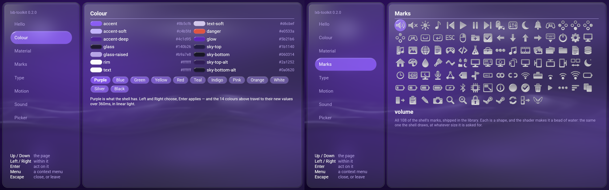

# lxb-toolkit

**Build applications that belong in [LineXinBar](https://github.com/Petexy/LineXinBar).**

The shell's own interface — its colours, its glass, its motion, its type, its
108 marks and its recordings — packaged as a library, so that something which is
not the shell can be built out of the same material and sit beside it.



[](LICENSE)
[](VERSION)
[](Cargo.toml)
[](docs/api-reference.md)

---

## Hello, world

```sh
lxb-new my-player                       # Rust, by default
lxb-new --language c my-player          # or C
lxb-new --language python my-player     # or Python
```

You get a buildable Wayland application, a matching desktop entry, an icon, and
one file to edit. The whole of that file is a function saying what is on the
page:

```rust
lxb_app::App::new("com.example.hello", "Hello World").run(|page| {
    page.head("launch", "Hello, world");
    if page.button("Hello World!") {
        println!("clicked");
    }
})
```

```python
app = lxb.App("com.example.HelloWorld", "Hello World")

@app.page
def _(page):
    page.head("launch", "Hello, world")
    if page.button("Hello World!"):
        print("clicked")

app.run()
```

```c
static void page(lxb_page *page, void *data)
{
    lxb_page_head(page, "launch", "Hello, world");
    if (lxb_page_button(page, "Hello World!")) {
        puts("clicked");
    }
}
```

That is a complete application: a Wayland window carrying the shell's wallpaper
and glass, driven by a keyboard, a pointer and every controller plugged into
the machine, answering with the shell's own sounds. **35 lines of Rust, 40 of
Python, 54 of C** — and not one of them names a colour, a radius, a duration or
a device.

## Why

Every value is asked for by name and answered by the library, so an application
tracks the shell instead of drifting from it:

```rust
page.metric(Metric::RowHeight)   // not 56.0
page.line(Text::Title)           // not 30.0
Role::TextSoft                   // not #d6cbef
```

Controls are numbered by the order they are drawn in, which is the order they
are read in — so the light moves between them in that order, and no application
registers, names or lays out a focus. **Both animations come free**: the light
travels between controls rather than jumping, and a press takes a control down
and springs it back.

## Install

Packages for Arch, Debian/Ubuntu, Fedora and Nix are built from this tree:

```sh
./packaging/build.sh arch      # | debian | fedora | nix
```

Three packages: the shared libraries, the development files (headers,
pkg-config, `lxb-new`, and the crate sources a generated project builds
against), and the Python binding. See
[`packaging/README.md`](packaging/README.md) for what each one carries.

## Documentation

| | |
|---|---|
| [**API reference**](docs/api-reference.md) | All generated C API functions, from the headers |
| [**Building an application**](docs/application-development.md) | The page, input, sound, lifecycle, desktop-entry and scaling contracts |
| [**The design language**](docs/design-language.md) | What the material *is*, for a renderer that is not this one |
| [**Python**](python/README.md) | The `ctypes` binding: no build step, no wheel per version |
| [**Examples**](examples/README.md) | Hello world and an eight-page tour, in three languages |
| [**Languages**](docs/localization.md) | The catalogs the controls speak from, and how to add a language |

## What is in it

- **Colour** — twelve palettes answering fourteen semantic roles, with one
  linear-light transition so every surface changes together.
- **Glass** — dense-panel, control and broad-pane cuts, and the shell's own
  refraction, dispersion, bevel and caustic as binding-free WGSL.
- **Marks** — all 108 `lxb:shape` SVGs, the exact signed-distance transform, and
  both the Default water-bead and Simple flat materials.
- **Wallpaper** — the analytic scene, and the record that hands its clock from
  one process to the next. A window that opens over a wallpaper already on
  screen is told which second it is and draws that frame, rather than starting
  the animation again in front of the user.
- **Motion and layout** — named durations, a critically damped spring, and the
  clamped `height / 1080` scale. Height, never width.
- **Input** — every controller on the machine and the keyboard as *one* list of
  actions, plus wheel and touchpad gestures that retain their fractions and,
  on a page with more than one list, the pointer target they belong to.
- **Sound** — the fourteen shipped recordings, the rests between two copies of
  one clip, and silence treated as a working state rather than a failure.
- **Components** — the context menu, dialog, built-in in-window file/folder
  picker, and a progressive blurred boundary for scrolling viewports, as
  shapes as well as materials.
- **File and folder selection** — one `Page::pick` / `page.pick` /
  `lxb_page_pick` call opens a centred Lattice window covering roughly seventy
  percent of the current app: path columns recede while the surrounding page
  falls back under strong frost. The raw lazy model is also available for
  custom renderers, with the shell's filters, ordering, search, and deliberate
  folder choice.
- **CSS** — custom properties, for a page that needs an honest flat
  approximation instead of a GPU material.

Every asset is compiled into the library, because the machine this is for may
have no desktop theme and no font service.

## Build from source

```sh
cargo build --release
cargo run -p lxb-new -- --toolkit-path crates/lxb-toolkit my-app
```

Nine crates, five of them shipped, behind **two shared libraries on purpose**:
`liblxb_toolkit` answers what the language is and links *nothing*, so a program
that only wants the answers pays nothing for a GPU. `liblxb_app` carries wgpu,
winit, gilrs and rodio, and is opened only by a program that wants a window.

The core builds with Rust 1.85; a generated GPU application states 1.87,
because that is wgpu 30's own minimum.

## Verify

```sh
cargo test --workspace --all-targets --locked
cargo clippy --workspace --all-targets --locked -- -D warnings
bash scripts/check-greetings.sh                    # 17 frames, byte for byte
bash scripts/check-sync.sh ../project-linexinbar   # against the shell it is transcribed from
bash packaging/build.sh check
python3 python/tests/test_toolkit.py               # the Python binding

# The examples are outside the workspace on purpose, so none of the above
# reaches them. They are checked the way an application is:
for example in examples/rust examples/rust-hello; do
    (cd "$example" && cargo fmt --check \
        && cargo clippy --all-targets --locked -- -D warnings \
        && cargo test --release --locked)
done
```

`check-greetings.sh` is the one worth knowing about: it draws the same frames
from two languages at once and compares them **byte for byte**. It is the only
check that catches a binding which crosses a value correctly and then uses it
slightly differently. Sixteen of its seventeen views are the C and Python tours
against each other; the seventeenth is the short greeting, which is the one view
written in all three languages. **The Rust tour is not one of them** — it is a
richer program with prose of its own rather than a third copy — so what covers
it is its own suite, and that suite is outside the workspace.

## Relationship to the shell

This is a **transcription** of LineXinBar, not a dependency of it — the two
repositories share no crate and neither builds the other. The commit it was
transcribed from is recorded in the source, and `check-sync.sh` compares the
glyphs, fonts, recordings, all seventy authored colours, every named duration
and metric, and the shaders against it.

The starter uses public Wayland APIs only. In particular `lxb_shell_v1` is not
an application SDK: it coordinates the compositor and the session shell, and
nothing here copies it.

## Licence

[GPL-3.0-only](LICENSE), matching LineXinBar. Roboto is bundled under
Apache-2.0 and carries its own notice.
